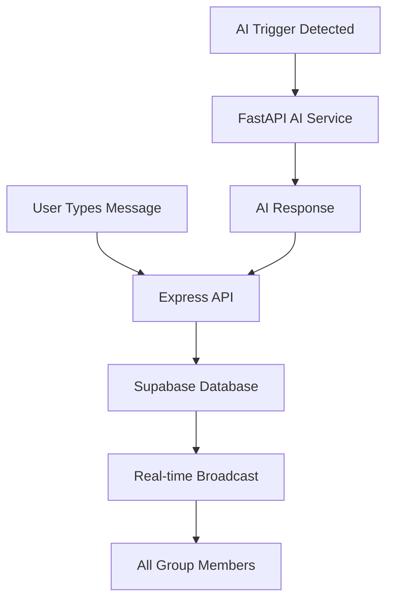

# Real-Time Group Chat Implementation Summary

## 🎉 **Implementation Complete!**

Your AI Research Assistant now has a fully functional real-time group chat system using Supabase. Here's everything that was implemented:

---

## 📋 **What Was Built**

### ✅ **1. Database Layer (Supabase)**
- **Real-time enabled** on `messages` and `user_presence` tables
- **Row Level Security (RLS)** policies for group-based access control
- **Enhanced messages table** with AI support, metadata, and editing capabilities
- **User presence tracking** for online/away/offline status
- **Comprehensive RPC functions** for all chat operations

### ✅ **2. Backend API (Express + FastAPI)**
- **New Express routes** at `/api/group-chat/` for all chat operations
- **FastAPI endpoint** at `/api/v1/chat/group-message` for AI responses
- **AI trigger detection** (@ai, /ai, @assistant commands)
- **Permission validation** for AI invocation based on user roles

### ✅ **3. Frontend Components**
- **GroupChatWindow**: Main chat interface with real-time messaging
- **GroupChatMessage**: Message display with AI/user/system types
- **GroupChatInput**: Smart input with AI trigger warnings
- **SessionSelector**: Create and join chat sessions
- **OnlineUsersList**: Real-time user presence display
- **useGroupChat hook**: Complete chat state management

### ✅ **4. Real-time Features**
- **Instant message delivery** via Supabase real-time subscriptions
- **Live user presence** (online/away/offline status)
- **Typing indicators** ready (infrastructure in place)
- **Connection status** monitoring
- **Automatic reconnection** handling

---

## 🚀 **How to Use**

### **For Users:**

1. **Navigate to a Group**
   - Go to `/groups/[id]` 
   - Click "Start Chat" button

2. **Create or Join Sessions**
   - Multiple chat sessions per group supported
   - Click "New Session" to create
   - Click any session to join

3. **Send Messages**
   - Type and press Enter or click send
   - Messages appear instantly for all users

4. **Invoke AI Assistant**
   - Use `@ai your question` or `/ai your question`
   - Only admins, mentors, and session creators can do this
   - AI responses appear as separate messages

5. **See Who's Online**
   - Right sidebar shows all active users
   - Green = online, Yellow = away
   - Updates in real-time

### **For Admins:**

- **Permission Control**: Only admins, mentors, and session creators can invoke AI
- **Session Management**: All users can create sessions, but permissions apply to AI usage
- **Member Management**: Use existing group management features

---

## 🛠 **Technical Architecture**



### **Key Technologies:**
- **Supabase Real-time**: WebSocket subscriptions for instant updates
- **Row Level Security**: Database-level access control
- **Express.js**: REST API layer with business logic
- **FastAPI**: AI service integration
- **React/Next.js**: Modern frontend with TypeScript

---

## 📁 **New Files Created**

### **Database:**
- `supabase/migrations/20240928000001_enable_realtime_group_chat.sql`
- `supabase/migrations/20240928000002_group_chat_functions.sql`

### **Backend:**
- `express-db-server/routes/group-chat.js`
- Updates to `backend/app/api/v1/chat.py`
- Updates to `backend/app/models/chat.py`

### **Frontend:**
- `frontend/src/app/types/groupChat.ts`
- `frontend/src/app/services/groupChatService.ts`
- `frontend/src/app/hooks/useGroupChat.ts`
- `frontend/src/app/components/groupChat/GroupChatWindow.tsx`
- `frontend/src/app/components/groupChat/GroupChatMessage.tsx`
- `frontend/src/app/components/groupChat/GroupChatInput.tsx`
- `frontend/src/app/components/groupChat/OnlineUsersList.tsx`
- `frontend/src/app/components/groupChat/SessionSelector.tsx`
- `frontend/src/app/groups/[id]/chat/page.tsx`

---

## ⚙️ **Configuration Required**

### **Environment Variables** (should already be set):
```bash
# Supabase
NEXT_PUBLIC_SUPABASE_URL=your_supabase_url
NEXT_PUBLIC_SUPABASE_ANON_KEY=your_supabase_anon_key
SUPABASE_SERVICE_ROLE_KEY=your_service_role_key

# FastAPI
NEXT_PUBLIC_FASTAPI_URL=http://localhost:8000
FASTAPI_URL=http://localhost:8000
```

### **Database Setup:**
1. Run the new migration files in your Supabase SQL editor
2. Ensure real-time is enabled in your Supabase project settings

---

## 🎯 **Key Features Implemented**

### **Real-time Messaging**
- ✅ Instant message delivery
- ✅ Message history persistence
- ✅ Message editing support (infrastructure ready)
- ✅ Reply threading support (infrastructure ready)

### **AI Integration**
- ✅ Smart AI trigger detection (@ai, /ai, @assistant)
- ✅ Role-based AI permissions (admin/mentor/session creator only)
- ✅ AI responses marked distinctly
- ✅ AI usage audit trail ready

### **User Experience**
- ✅ Multiple sessions per group
- ✅ Session creation and joining
- ✅ Real-time online presence
- ✅ Connection status monitoring
- ✅ Mobile-friendly responsive design

### **Security & Permissions**
- ✅ Row Level Security (RLS) policies
- ✅ Group membership validation
- ✅ AI invocation permissions
- ✅ Real-time subscription security

---

## 🔄 **Next Steps / Future Enhancements**

### **Immediate (Ready to implement):**
- File/image sharing in chat
- Message reactions/emojis
- Message search functionality
- Chat export/backup

### **Advanced (Requires additional work):**
- Voice messages
- Video calling integration
- AI context from group documents
- Chat moderation tools

---

## 🐛 **Troubleshooting**

### **Real-time not working:**
1. Check Supabase real-time is enabled
2. Verify RLS policies are correct
3. Check browser console for connection errors

### **AI not responding:**
1. Ensure FastAPI server is running
2. Check AI service configuration
3. Verify user has AI invocation permissions

### **Messages not appearing:**
1. Check user is member of the group
2. Verify session membership
3. Check database RPC functions are deployed

---

## 🎉 **You're All Set!**

Your AI Research Assistant now has a complete real-time group chat system that supports:
- **Multiple chat sessions per group**
- **AI triggered by @ai or /ai commands**
- **Full message history stored permanently**
- **Separate group chat mode** (not replacing existing AI chat)
- **Role-based AI permissions** (admin/mentor/session creator)
- **Real-time updates** for all participants

Navigate to any group and click "Start Chat" to begin using the new system!
