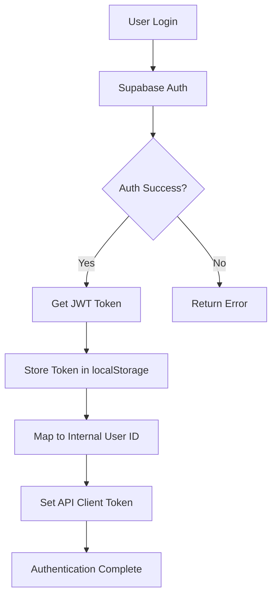

# Authentication System Documentation

This document provides comprehensive documentation for the authentication system in the AI Research Assistant application. The system uses a sophisticated multi-layer architecture with Supabase Auth, custom user management, and development mode support.

## Table of Contents

1. [Architecture Overview](#architecture-overview)
2. [Supabase Integration](#supabase-integration)
3. [User Management System](#user-management-system)
4. [Development Authentication](#development-authentication)
5. [Authentication Debugging](#authentication-debugging)
6. [API Authentication](#api-authentication)
7. [Frontend Integration](#frontend-integration)
8. [Security Considerations](#security-considerations)
9. [Troubleshooting](#troubleshooting)
10. [Best Practices](#best-practices)

---

## Architecture Overview

The authentication system follows a **dual-layer approach**:

### 1. **Primary Layer: Supabase Authentication**
- Handles user registration, login, and session management
- Provides JWT tokens for API authentication
- Manages password resets and email verification
- Supports OAuth providers (Google, GitHub, etc.)

### 2. **Secondary Layer: Internal User Management**
- Maps Supabase users to internal database records
- Manages user profiles and application-specific data
- Provides fallback and development authentication modes
- Handles user context across the 3-service architecture

### Authentication Flow



## Supabase Integration

### Configuration

The Supabase client is configured with specific settings for the application:

```typescript
const supabase = createClient(supabaseUrl, supabaseAnonKey, {
  auth: {
    autoRefreshToken: true,
    persistSession: true,
    detectSessionInUrl: false // Prevents URL conflicts
  }
});
```

### Key Features

- **Auto Refresh**: Tokens automatically refresh before expiration
- **Persistent Sessions**: Sessions survive browser restarts
- **URL Detection Disabled**: Prevents callback URL conflicts in SPA

### Environment Variables

```bash
# Required for Supabase integration
NEXT_PUBLIC_SUPABASE_URL=https://your-project.supabase.co
NEXT_PUBLIC_SUPABASE_ANON_KEY=your-anon-key-here
```

## User Management System

### Dual ID System

The application maintains a mapping between:
- **Supabase Auth ID**: UUID from Supabase (`auth_user_id`)
- **Internal Database ID**: Integer primary key (`user_id`)

### User ID Mapping Process

```typescript
// Get or create internal user ID mapping
async getInternalUserId(supabaseUser: User): Promise<number> {
  // 1. Check cached mapping
  const storageKey = `internal_user_id_${supabaseUser.id}`;
  const storedId = localStorage.getItem(storageKey);
  
  // 2. Query database for user record
  const users = await apiClient.get('/users/');
  let matchingUser = users.find(user => user.auth_user_id === supabaseUser.id);
  
  // 3. Fallback: lookup by email
  if (!matchingUser && supabaseUser.email) {
    matchingUser = users.find(user => user.email === supabaseUser.email);
  }
  
  // 4. Create user record if not found
  if (!matchingUser) {
    matchingUser = await this.createUserRecord(supabaseUser);
  }
  
  // 5. Cache and return internal ID
  localStorage.setItem(storageKey, matchingUser.id.toString());
  return matchingUser.id;
}
```

### User Record Creation

When a new user signs up, the system automatically creates a database record:

```typescript
private async createUserRecord(supabaseUser: User): Promise<any> {
  const metadata = supabaseUser.user_metadata;
  const fullName = metadata?.full_name || metadata?.name || '';
  const nameParts = fullName.split(' ').filter(Boolean);
  
  const userData = {
    auth_user_id: supabaseUser.id,
    email: supabaseUser.email,
    first_name: nameParts[0] || supabaseUser.email?.split('@')[0] || 'User',
    last_name: nameParts.length > 1 ? nameParts.slice(1).join(' ') : null,
    profile_picture_url: metadata?.avatar_url || null,
    availability: 'available'
  };
  
  return await apiClient.post('/users/create-from-auth', userData);
}
```

## Development Authentication

### DevAuth Service

For development convenience, the system includes a mock authentication service:

```typescript
export class DevAuthService {
  private static mockUser: MockUser = {
    id: '1',
    email: 'dev@test.com',
    user_metadata: {
      full_name: 'Development User',
      name: 'Dev User'
    }
  };
  
  // Enable development mode
  static setupMockAuth(): void {
    if (!this.shouldUseMockAuth()) return;
    
    const mockToken = this.createMockToken();
    localStorage.setItem('access_token', mockToken);
    localStorage.setItem('dev_mode', 'true');
  }
  
  // Check if development mode should be used
  static shouldUseMockAuth(): boolean {
    return process.env.NODE_ENV === 'development';
  }
}
```

### Using Development Mode

Development mode automatically activates when:
1. `NODE_ENV=development`
2. No real Supabase session exists
3. `dev_mode=true` in localStorage

**Manual Activation:**
```typescript
import { devAuth } from './services/devAuth';

// Enable development authentication
devAuth.setupMockAuth();

// Clear development authentication
devAuth.clearMockAuth();
```

## Authentication Debugging

### AuthDebugger Service

The application includes comprehensive debugging tools:

```typescript
export class AuthDebugger {
  // Get complete authentication state
  static async getFullDebugInfo(): Promise<AuthDebugInfo> {
    return {
      supabaseSession: await supabase.auth.getSession(),
      supabaseUser: await supabase.auth.getUser(),
      localStorageTokens: {
        accessToken: localStorage.getItem('access_token'),
        refreshToken: localStorage.getItem('refresh_token'),
        devMode: localStorage.getItem('dev_mode')
      },
      internalUserId: this.getInternalUserId(),
      apiConnectivity: await this.testApiConnectivity(),
      databaseUserRecord: await this.getDatabaseUserRecord()
    };
  }
  
  // Diagnose common authentication issues
  static async diagnoseAuthIssues(): Promise<string[]> {
    const issues: string[] = [];
    const debugInfo = await this.getFullDebugInfo();
    
    if (!debugInfo.supabaseUser) {
      issues.push('❌ No authenticated Supabase user');
    }
    
    if (!debugInfo.localStorageTokens.accessToken) {
      issues.push('⚠️ No access token in localStorage');
    }
    
    if (!debugInfo.apiConnectivity) {
      issues.push('❌ Cannot connect to API');
    }
    
    return issues;
  }
}
```

### Debug Panel

Access the debug panel at `/debug/auth` for:
- **Authentication state inspection**
- **Automatic issue diagnosis**
- **One-click fixes for common problems**
- **Debug report generation**

### Debug Commands

```javascript
// Manual debugging in browser console
import { authDebugger } from './services/authDebugger';

// Get full debug information
const debugInfo = await authDebugger.getFullDebugInfo();

// Diagnose issues
const issues = await authDebugger.diagnoseAuthIssues();

// Attempt automatic fixes
const fixes = await authDebugger.attemptAutoFix();

// Generate debug report
const report = authDebugger.generateDebugReport();
```

## API Authentication

### Token Management

The system automatically manages JWT tokens for API calls:

```typescript
// Token storage and retrieval
localStorage.setItem('access_token', session.access_token);
localStorage.setItem('refresh_token', session.refresh_token);

// API client configuration
apiClient.setAuthToken(session.access_token);
```

### API Client Integration

The API client automatically includes authentication headers:

```typescript
// Authenticated API call
const response = await apiClient.get('/users/me');

// Manual header inclusion
const response = await fetch('/api/endpoint', {
  headers: {
    'Authorization': `Bearer ${localStorage.getItem('access_token')}`,
    'Content-Type': 'application/json'
  }
});
```

### Cross-Service Authentication

**Frontend → Express DB Server:**
```typescript
// Uses JWT token from Supabase
headers: {
  'Authorization': `Bearer ${accessToken}`
}
```

**Frontend → FastAPI AI Server:**
```typescript
// Uses same JWT token for AI operations
headers: {
  'Authorization': `Bearer ${accessToken}`
}
```

**FastAPI → Express (Internal):**
```typescript
// FastAPI uses HTTP client for database operations
const response = await httpx.post(
  `${EXPRESS_DB_URL}/api/users/`,
  headers={'Authorization': f'Bearer {token}'}
)
```

## Frontend Integration

### AuthService Usage

```typescript
import { authService } from './services/authService';

// Initialize authentication on app startup
await authService.initializeAuth();

// Sign in user
const { user, session } = await authService.signIn(email, password);

// Get current user
const user = await authService.getCurrentUser();

// Get internal user ID
const internalId = await authService.getInternalUserId(user);

// Sign out
await authService.signOut();
```

### React Integration

```tsx
import { useEffect, useState } from 'react';
import { authService, User } from './services/authService';

export function useAuth() {
  const [user, setUser] = useState<User | null>(null);
  const [loading, setLoading] = useState(true);

  useEffect(() => {
    // Initialize auth state
    const initAuth = async () => {
      const currentUser = await authService.getCurrentUser();
      setUser(currentUser);
      setLoading(false);
    };

    initAuth();

    // Listen for auth state changes
    const { data: { subscription } } = authService.onAuthStateChange(
      (event, session) => {
        setUser(session?.user || null);
      }
    );

    return () => subscription.unsubscribe();
  }, []);

  return { user, loading };
}
```

### Protected Routes

```tsx
import { useRouter } from 'next/navigation';
import { useAuth } from './hooks/useAuth';

export function ProtectedRoute({ children }: { children: React.ReactNode }) {
  const { user, loading } = useAuth();
  const router = useRouter();

  useEffect(() => {
    if (!loading && !user) {
      router.push('/login');
    }
  }, [user, loading, router]);

  if (loading) {
    return <div>Loading...</div>;
  }

  if (!user) {
    return null; // Will redirect to login
  }

  return <>{children}</>;
}
```

## Security Considerations

### Token Security

1. **Storage**: Tokens stored in localStorage (consider httpOnly cookies for production)
2. **Transmission**: Always use HTTPS in production
3. **Expiration**: Tokens auto-refresh before expiration
4. **Scope**: Tokens have limited scope and permissions

### Session Management

1. **Auto-logout**: Sessions expire after inactivity
2. **Token Validation**: Server-side token validation on each request
3. **Refresh Tokens**: Secure refresh mechanism prevents token theft impact

### Development Security

1. **Mock Authentication**: Only enabled in development mode
2. **Environment Separation**: Different configurations for dev/prod
3. **Debug Tools**: Debug endpoints disabled in production

## Troubleshooting

### Common Issues

#### 1. "Unable to get user information" Error

**Symptoms:**
- User appears logged in but API calls fail
- Internal user ID is null or undefined

**Solutions:**
```typescript
// Check authentication state
const debugInfo = await authDebugger.getFullDebugInfo();

// Refresh user mapping
await authService.refreshInternalUserId();

// Clear and re-authenticate
await authService.signOut();
// User signs in again
```

#### 2. Token Expiration Issues

**Symptoms:**
- 401 Unauthorized errors
- Automatic logouts

**Solutions:**
```typescript
// Manual token refresh
const session = await authService.getCurrentSession();

// Check token expiration
const token = localStorage.getItem('access_token');
if (token) {
  const payload = JSON.parse(atob(token.split('.')[1]));
  const isExpired = payload.exp * 1000 < Date.now();
}
```

#### 3. Development Mode Issues

**Symptoms:**
- Authentication works in production but not development
- Missing user context in development

**Solutions:**
```typescript
// Enable development mode
devAuth.setupMockAuth();

// Check development mode status
const isDevMode = devAuth.isUsingMockAuth();

// Clear development mode
devAuth.clearMockAuth();
```

### Debug Checklist

1. **Check Supabase Configuration:**
   ```bash
   echo $NEXT_PUBLIC_SUPABASE_URL
   echo $NEXT_PUBLIC_SUPABASE_ANON_KEY
   ```

2. **Verify API Connectivity:**
   ```typescript
   const response = await fetch('/api/health');
   console.log(response.status);
   ```

3. **Check Token Storage:**
   ```typescript
   console.log('Access Token:', localStorage.getItem('access_token'));
   console.log('Refresh Token:', localStorage.getItem('refresh_token'));
   ```

4. **Verify User Mapping:**
   ```typescript
   const user = await authService.getCurrentUser();
   const internalId = await authService.getInternalUserId(user);
   ```

## Best Practices

### Development

1. **Use Development Mode**: Enable mock auth for easier development
2. **Regular Token Checks**: Monitor token expiration during development
3. **Debug Panel**: Use `/debug/auth` for troubleshooting
4. **Clear State**: Clear auth state when switching between real/mock auth

### Production

1. **Environment Variables**: Secure storage of Supabase credentials
2. **HTTPS Only**: Always use HTTPS for token transmission
3. **Token Rotation**: Implement proper token refresh mechanisms
4. **Monitoring**: Monitor authentication success/failure rates

### Code Organization

1. **Single AuthService**: Use singleton pattern for auth service
2. **Centralized Token Management**: Handle tokens in one place
3. **Error Handling**: Comprehensive error handling for auth operations
4. **Type Safety**: Use TypeScript interfaces for user objects

### User Experience

1. **Loading States**: Show loading states during auth operations
2. **Error Messages**: Clear, user-friendly error messages
3. **Auto-retry**: Automatic retry for transient auth failures
4. **Graceful Fallbacks**: Fallback modes for auth failures

## API Endpoints

### Authentication Endpoints (Express DB Server)

```
GET    /api/auth/status          # Get authentication status
GET    /api/auth/me              # Get current user profile
PUT    /api/auth/me              # Update user profile
POST   /api/auth/sync-profile    # Sync profile with Supabase auth
```

### User Management Endpoints

```
GET    /api/users/               # Get all users (admin)
POST   /api/users/               # Create new user
GET    /api/users/:id            # Get user by ID
PUT    /api/users/:id            # Update user
DELETE /api/users/:id            # Delete user
POST   /api/users/create-from-auth # Create user from auth data
```

### Health Check Endpoints

```
GET    /health                   # Nginx health check
GET    /api/health               # Express server health
GET    /ai/health                # FastAPI server health
```

This authentication system provides a robust, secure, and developer-friendly foundation for the AI Research Assistant application, supporting both production requirements and development convenience.