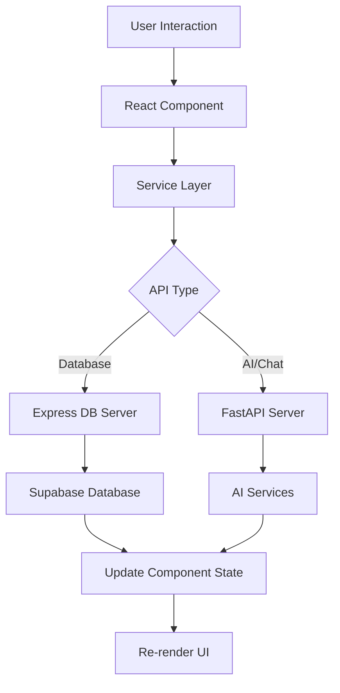

# Frontend Development Guide

This document provides a comprehensive guide to developing the frontend of the AI Research Assistant application. The frontend is built with Next.js 13+ using the App Router, TypeScript, and Tailwind CSS, following modern React patterns and best practices.

## Table of Contents

1. [Architecture Overview](#architecture-overview)
2. [Project Structure](#project-structure)
3. [Technology Stack](#technology-stack)
4. [Component Organization](#component-organization)
5. [Service Layer](#service-layer)
6. [State Management](#state-management)
7. [Routing & Navigation](#routing--navigation)
8. [Styling System](#styling-system)
9. [Development Workflow](#development-workflow)
10. [Environment Configuration](#environment-configuration)
11. [Build & Deployment](#build--deployment)
12. [Best Practices](#best-practices)
13. [Troubleshooting](#troubleshooting)

---

## Architecture Overview

The frontend follows a **modern React architecture** with clear separation of concerns:

### Core Principles

1. **Component-Based Architecture**: Reusable, composable components
2. **Service Layer Pattern**: Business logic separated from UI components
3. **Context-Based State Management**: Global state via React Context
4. **Type Safety**: Full TypeScript implementation
5. **Server-Side Integration**: Seamless integration with Express DB and FastAPI servers

### Application Flow



## Project Structure

```
frontend/
├── src/app/                    # Next.js App Router
│   ├── components/            # Reusable UI components
│   │   ├── Navigation.tsx     # Main navigation
│   │   ├── Chat.tsx          # Chat interface
│   │   ├── groups/           # Group-related components
│   │   ├── sessions/         # Session components
│   │   └── ui/               # Base UI components
│   ├── contexts/             # React Context providers
│   │   ├── UserContext.tsx   # Global user state
│   │   └── index.ts          # Context exports
│   ├── hooks/                # Custom React hooks
│   ├── services/             # API and business logic
│   │   ├── authService.ts    # Authentication
│   │   ├── api.ts           # HTTP client
│   │   ├── chatService.ts   # Chat functionality
│   │   ├── paperService.ts  # Paper management
│   │   └── groupService.ts  # Group operations
│   ├── types/               # TypeScript type definitions
│   ├── auth/               # Authentication pages
│   ├── chat/               # Chat interface pages
│   ├── groups/             # Group management pages
│   ├── papers/             # Paper browsing pages
│   ├── profile/            # User profile pages
│   ├── settings/           # Application settings
│   ├── debug/              # Development debugging tools
│   ├── layout.tsx          # Root layout component
│   ├── page.tsx           # Home page
│   └── globals.css        # Global styles
├── public/                # Static assets
├── package.json          # Dependencies and scripts
├── next.config.ts       # Next.js configuration
├── tailwind.config.ts   # Tailwind CSS configuration
└── tsconfig.json       # TypeScript configuration
```

## Technology Stack

### Core Technologies

- **Next.js 15.5.3**: React framework with App Router
- **React 19.1.0**: UI library with modern hooks
- **TypeScript 5**: Static type checking
- **Tailwind CSS 4**: Utility-first CSS framework

### Key Dependencies

```json
{
  "dependencies": {
    "@heroicons/react": "^2.2.0",        // Icon library
    "@supabase/supabase-js": "^2.57.4",  // Supabase client
    "axios": "^1.10.0",                  // HTTP client
    "react-markdown": "^10.1.0",        // Markdown rendering
    "remark-gfm": "^4.0.1",            // GitHub Flavored Markdown
    "sonner": "^2.0.6",                // Toast notifications
    "clsx": "^2.1.1"                   // Conditional class names
  }
}
```

### Font Configuration

```typescript
// Custom font setup using Fira Code
const firaCode = Fira_Code({
  variable: "--font-fira-code",
  subsets: ["latin"],
  weight: ["300", "400", "500", "600", "700"],
});
```

## Component Organization

### Component Hierarchy

```
Components/
├── Layout Components
│   ├── Navigation.tsx        # Main navigation bar
│   ├── MainWindow.tsx       # Content container
│   └── TopBar.tsx           # Page header
├── Feature Components
│   ├── Chat.tsx             # Chat interface
│   ├── ChatBlock.tsx        # Individual chat message
│   ├── InputBar.tsx         # Message input
│   ├── groups/              # Group components
│   └── sessions/            # Session components
├── UI Components
│   ├── Button.tsx           # Base button component
│   ├── Input.tsx            # Form inputs
│   ├── Modal.tsx            # Modal dialogs
│   └── LoadingSpinner.tsx   # Loading states
└── Page Components
    ├── LoginPage.tsx        # Authentication
    ├── DashboardPage.tsx    # Main dashboard
    └── SettingsPage.tsx     # User settings
```

### Component Patterns

#### 1. Functional Components with Hooks

```tsx
"use client";

import React, { useState, useEffect } from 'react';
import { useUser } from '../contexts';

interface ComponentProps {
  title: string;
  onAction?: (data: any) => void;
}

export default function ExampleComponent({ title, onAction }: ComponentProps) {
  const [loading, setLoading] = useState(false);
  const { user, isAuthenticated } = useUser();

  useEffect(() => {
    // Component initialization
  }, []);

  const handleAction = async () => {
    setLoading(true);
    try {
      // Async operation
      onAction?.(result);
    } catch (error) {
      console.error('Action failed:', error);
    } finally {
      setLoading(false);
    }
  };

  return (
    <div className="component-container">
      <h1>{title}</h1>
      {/* Component content */}
    </div>
  );
}
```

#### 2. Server Components vs Client Components

```tsx
// Server Component (default in app router)
export default function ServerComponent() {
  // Can directly access server-side data
  return <div>Server-rendered content</div>;
}

// Client Component (interactive)
"use client";
export default function ClientComponent() {
  // Can use hooks, event handlers, browser APIs
  const [state, setState] = useState(null);
  return <div>Interactive content</div>;
}
```

## Service Layer

The service layer abstracts API communication and business logic from components.

### API Client Architecture

```typescript
// Base API client with authentication
export class ApiClient {
  private baseURL: string;

  constructor(baseURL: string = API_BASE_URL) {
    this.baseURL = baseURL;
  }

  private async request<T>(endpoint: string, options: RequestInit = {}): Promise<T> {
    const url = `${this.baseURL}${endpoint}`;
    
    const config: RequestInit = {
      headers: {
        'Content-Type': 'application/json',
        ...options.headers,
      },
      ...options,
    };

    // Add auth token if available
    const token = this.getAuthToken();
    if (token) {
      config.headers = {
        ...config.headers,
        Authorization: `Bearer ${token}`,
      };
    }

    const response = await fetch(url, config);
    
    if (!response.ok) {
      throw new ApiError(errorMessage, response.status, errorData);
    }

    return response.json();
  }

  // HTTP methods
  async get<T>(endpoint: string, params?: Record<string, any>): Promise<T> {
    const url = params ? `${endpoint}?${new URLSearchParams(params)}` : endpoint;
    return this.request<T>(url, { method: 'GET' });
  }

  async post<T>(endpoint: string, data?: any): Promise<T> {
    return this.request<T>(endpoint, {
      method: 'POST',
      body: data ? JSON.stringify(data) : undefined,
    });
  }
}
```

### Service Implementation Pattern

```typescript
// Example: Paper Service
export class PaperService {
  private apiClient: ApiClient;

  constructor(apiClient: ApiClient) {
    this.apiClient = apiClient;
  }

  async getPapers(params?: {
    limit?: number;
    offset?: number;
    search?: string;
  }): Promise<Paper[]> {
    return this.apiClient.get<Paper[]>('/papers', params);
  }

  async createPaper(paperData: CreatePaperRequest): Promise<Paper> {
    return this.apiClient.post<Paper>('/papers', paperData);
  }

  async searchArxiv(query: string, categories?: string[]): Promise<ArxivPaper[]> {
    return this.apiClient.post<ArxivPaper[]>('/papers/search/arxiv', {
      query,
      categories,
      limit: 20
    });
  }
}

// Export singleton instance
export const paperService = new PaperService(apiClient);
```

### Service Integration in Components

```tsx
import { paperService } from '../services/paperService';
import { useUser } from '../contexts';

export default function PapersList() {
  const [papers, setPapers] = useState<Paper[]>([]);
  const [loading, setLoading] = useState(true);
  const { isAuthenticated } = useUser();

  useEffect(() => {
    const loadPapers = async () => {
      try {
        const fetchedPapers = await paperService.getPapers({ limit: 20 });
        setPapers(fetchedPapers);
      } catch (error) {
        console.error('Failed to load papers:', error);
      } finally {
        setLoading(false);
      }
    };

    if (isAuthenticated) {
      loadPapers();
    }
  }, [isAuthenticated]);

  return (
    <div>
      {loading ? (
        <LoadingSpinner />
      ) : (
        papers.map(paper => <PaperCard key={paper.id} paper={paper} />)
      )}
    </div>
  );
}
```

## State Management

### Global State with React Context

#### UserContext Implementation

```tsx
interface UserContextType {
  // Core user state
  user: SupabaseUser | null;
  internalUserId: number | null;
  isAuthenticated: boolean;
  isLoading: boolean;
  error: string | null;
  
  // Authentication actions
  signIn: (email: string, password: string) => Promise<{ success: boolean; error?: string }>;
  signOut: () => Promise<void>;
  
  // Utility functions
  getUserDisplayName: () => string;
  canCreateGroups: () => boolean;
  refreshUser: () => Promise<void>;
}

export function UserProvider({ children }: UserProviderProps) {
  const [user, setUser] = useState<SupabaseUser | null>(null);
  const [internalUserId, setInternalUserId] = useState<number | null>(null);
  const [isLoading, setIsLoading] = useState(true);

  // Context implementation...
  
  return (
    <UserContext.Provider value={contextValue}>
      {children}
    </UserContext.Provider>
  );
}
```

#### Using Context in Components

```tsx
import { useUser } from '../contexts';

export default function ProfilePage() {
  const { 
    user, 
    isAuthenticated, 
    getUserDisplayName, 
    signOut 
  } = useUser();

  if (!isAuthenticated) {
    return <div>Please log in</div>;
  }

  return (
    <div>
      <h1>Welcome, {getUserDisplayName()}!</h1>
      <button onClick={signOut}>Sign Out</button>
    </div>
  );
}
```

### Local State Management

#### useState for Component State

```tsx
export default function ChatInterface() {
  const [messages, setMessages] = useState<Message[]>([]);
  const [inputValue, setInputValue] = useState('');
  const [isTyping, setIsTyping] = useState(false);

  const addMessage = (message: Message) => {
    setMessages(prev => [...prev, message]);
  };

  const handleSendMessage = async () => {
    setIsTyping(true);
    try {
      const response = await chatService.sendMessage(inputValue);
      addMessage(response);
      setInputValue('');
    } finally {
      setIsTyping(false);
    }
  };

  return (
    <div>
      <MessageList messages={messages} />
      <InputBar 
        value={inputValue}
        onChange={setInputValue}
        onSend={handleSendMessage}
        disabled={isTyping}
      />
    </div>
  );
}
```

#### useEffect for Side Effects

```tsx
export default function GroupDetails({ groupId }: { groupId: string }) {
  const [group, setGroup] = useState<Group | null>(null);
  const [members, setMembers] = useState<User[]>([]);

  // Load group data on mount and when groupId changes
  useEffect(() => {
    const loadGroupData = async () => {
      try {
        const [groupData, memberData] = await Promise.all([
          groupService.getGroup(groupId),
          groupService.getGroupMembers(groupId)
        ]);
        setGroup(groupData);
        setMembers(memberData);
      } catch (error) {
        console.error('Failed to load group data:', error);
      }
    };

    loadGroupData();
  }, [groupId]);

  return (
    <div>
      {group && (
        <>
          <h1>{group.name}</h1>
          <MembersList members={members} />
        </>
      )}
    </div>
  );
}
```

## Routing & Navigation

### App Router Structure

```
app/
├── layout.tsx              # Root layout
├── page.tsx               # Home page (/)
├── login/
│   └── page.tsx          # Login page (/login)
├── chat/
│   ├── page.tsx          # Chat home (/chat)
│   └── [sessionId]/
│       └── page.tsx      # Chat session (/chat/[sessionId])
├── groups/
│   ├── page.tsx          # Groups list (/groups)
│   ├── create/
│   │   └── page.tsx      # Create group (/groups/create)
│   └── [groupId]/
│       ├── page.tsx      # Group details (/groups/[groupId])
│       └── chat/
│           └── page.tsx  # Group chat (/groups/[groupId]/chat)
├── papers/
│   ├── page.tsx          # Papers list (/papers)
│   └── [paperId]/
│       └── page.tsx      # Paper details (/papers/[paperId])
└── profile/
    └── page.tsx          # User profile (/profile)
```

### Navigation Component

```tsx
const Navigation = () => {
  const { isAuthenticated, getUserDisplayName, signOut } = useUser();
  const pathname = usePathname();
  const router = useRouter();

  const navigationItems = [
    { href: '/papers', label: 'Papers', icon: DocumentTextIcon },
    { href: '/chat', label: 'Chat', icon: ChatBubbleLeftRightIcon },
    { href: '/groups', label: 'Groups', icon: UserGroupIcon },
  ];

  return (
    <nav className="bg-gray-900 border-b border-gray-800">
      <div className="max-w-7xl mx-auto px-4">
        <div className="flex justify-between h-16">
          {/* Logo */}
          <Link href="/" className="flex items-center">
            <span className="text-xl font-bold text-white">AI Research Assistant</span>
          </Link>

          {/* Navigation Links */}
          {isAuthenticated && (
            <div className="flex space-x-8">
              {navigationItems.map((item) => (
                <Link
                  key={item.href}
                  href={item.href}
                  className={`flex items-center px-3 py-2 rounded-md text-sm font-medium ${
                    pathname === item.href
                      ? 'bg-gray-700 text-white'
                      : 'text-gray-300 hover:text-white hover:bg-gray-700'
                  }`}
                >
                  <item.icon className="w-5 h-5 mr-2" />
                  {item.label}
                </Link>
              ))}
            </div>
          )}

          {/* User Menu */}
          {isAuthenticated && (
            <UserDropdownMenu 
              userName={getUserDisplayName()}
              onSignOut={signOut}
            />
          )}
        </div>
      </div>
    </nav>
  );
};
```

### Protected Routes

```tsx
import { useRouter } from 'next/navigation';
import { useUser } from '../contexts';

export function ProtectedRoute({ children }: { children: React.ReactNode }) {
  const { user, isLoading } = useUser();
  const router = useRouter();

  useEffect(() => {
    if (!isLoading && !user) {
      router.push('/login');
    }
  }, [user, isLoading, router]);

  if (isLoading) {
    return (
      <div className="min-h-screen flex items-center justify-center">
        <div className="animate-spin rounded-full h-32 w-32 border-b-2 border-white"></div>
      </div>
    );
  }

  if (!user) {
    return null; // Will redirect to login
  }

  return <>{children}</>;
}
```

## Styling System

### Tailwind CSS Configuration

```typescript
module.exports = {
  content: [
    "./src/pages/**/*.{js,ts,jsx,tsx,mdx}",
    "./src/components/**/*.{js,ts,jsx,tsx,mdx}",
    "./src/app/**/*.{js,ts,jsx,tsx,mdx}",
  ],
  darkMode: "class",
  theme: {
    extend: {
      fontFamily: {
        mono: ['var(--font-fira-code)', 'FiraCode Nerd Font', 'Fira Code', 'monospace'],
      },
      animation: {
        shimmer: "shimmer 2s linear infinite",
      },
      keyframes: {
        shimmer: {
          from: { backgroundPosition: "0 0" },
          to: { backgroundPosition: "-200% 0" },
        },
      },
    },
  },
  plugins: [],
};
```

### Design System

#### Color Palette

```css
/* Primary Colors */
.bg-gray-950  /* Main background */
.bg-gray-900  /* Card/container background */
.bg-gray-800  /* Secondary background */
.bg-gray-700  /* Hover states */

/* Text Colors */
.text-white   /* Primary text */
.text-gray-300 /* Secondary text */
.text-gray-400 /* Muted text */

/* Accent Colors */
.bg-blue-600  /* Primary action */
.bg-green-600 /* Success states */
.bg-red-600   /* Error states */
.bg-yellow-600 /* Warning states */
```

#### Typography

```css
/* Font Sizes */
.text-sm      /* 14px - Small text */
.text-base    /* 16px - Body text */
.text-lg      /* 18px - Large text */
.text-xl      /* 20px - Headings */
.text-2xl     /* 24px - Page titles */
.text-3xl     /* 30px - Hero text */

/* Font Weights */
.font-normal  /* 400 - Regular text */
.font-medium  /* 500 - Emphasized text */
.font-semibold /* 600 - Headings */
.font-bold    /* 700 - Strong emphasis */
```

#### Spacing System

```css
/* Margins and Padding */
.p-4          /* 16px padding */
.px-6         /* 24px horizontal padding */
.py-2         /* 8px vertical padding */
.m-4          /* 16px margin */
.mb-6         /* 24px bottom margin */

/* Gaps */
.space-x-4    /* 16px horizontal gap between children */
.space-y-2    /* 8px vertical gap between children */
.gap-4        /* 16px gap in flex/grid */
```

### Component Styling Patterns

#### Button Components

```tsx
interface ButtonProps {
  variant?: 'primary' | 'secondary' | 'danger';
  size?: 'sm' | 'md' | 'lg';
  children: React.ReactNode;
  onClick?: () => void;
  disabled?: boolean;
}

export function Button({ variant = 'primary', size = 'md', children, ...props }: ButtonProps) {
  const baseClasses = 'rounded-md font-medium transition-colors duration-200';
  
  const variantClasses = {
    primary: 'bg-blue-600 text-white hover:bg-blue-700 disabled:bg-blue-400',
    secondary: 'bg-gray-600 text-white hover:bg-gray-700 disabled:bg-gray-400',
    danger: 'bg-red-600 text-white hover:bg-red-700 disabled:bg-red-400'
  };
  
  const sizeClasses = {
    sm: 'px-3 py-1 text-sm',
    md: 'px-4 py-2 text-base',
    lg: 'px-6 py-3 text-lg'
  };

  const className = `${baseClasses} ${variantClasses[variant]} ${sizeClasses[size]}`;

  return (
    <button className={className} {...props}>
      {children}
    </button>
  );
}
```

#### Responsive Design

```tsx
export function ResponsiveGrid({ children }: { children: React.ReactNode }) {
  return (
    <div className="grid grid-cols-1 md:grid-cols-2 lg:grid-cols-3 xl:grid-cols-4 gap-6">
      {children}
    </div>
  );
}

export function ResponsiveContainer({ children }: { children: React.ReactNode }) {
  return (
    <div className="container mx-auto px-4 sm:px-6 lg:px-8 max-w-7xl">
      {children}
    </div>
  );
}
```

## Development Workflow

### Local Development Setup

1. **Prerequisites**:
   ```bash
   node --version  # Should be >= 18.0.0
   npm --version   # Should be >= 8.0.0
   ```

2. **Installation**:
   ```bash
   cd frontend
   npm install
   ```

3. **Environment Setup**:
   ```bash
   cp .env.example .env.local
   # Edit .env.local with your configuration
   ```

4. **Start Development Server**:
   ```bash
   npm run dev
   # Runs on http://localhost:3000
   ```

### Development Scripts

```json
{
  "scripts": {
    "dev": "next dev -H 0.0.0.0 -p 3000",     // Development server
    "build": "next build",                      // Production build
    "start": "next start -H 0.0.0.0 -p 3000", // Production server
    "lint": "next lint",                       // ESLint checking
    "type-check": "tsc --noEmit"              // TypeScript checking
  }
}
```

### Hot Reload and Live Development

The development server supports:
- **Hot Module Replacement**: Components update without page refresh
- **Fast Refresh**: Preserves component state during edits
- **Auto-compilation**: TypeScript and CSS compile automatically
- **Error Overlay**: Development errors display in browser

### Code Quality Tools

#### ESLint Configuration

```json
{
  "extends": [
    "next/core-web-vitals",
    "@typescript-eslint/recommended"
  ],
  "rules": {
    "@typescript-eslint/no-unused-vars": "error",
    "@typescript-eslint/no-explicit-any": "warn",
    "react-hooks/exhaustive-deps": "warn"
  }
}
```

#### TypeScript Configuration

```json
{
  "compilerOptions": {
    "target": "ES2017",
    "lib": ["dom", "dom.iterable", "es6"],
    "allowJs": true,
    "skipLibCheck": true,
    "strict": true,
    "forceConsistentCasingInFileNames": true,
    "noEmit": true,
    "esModuleInterop": true,
    "module": "esnext",
    "moduleResolution": "node",
    "resolveJsonModule": true,
    "isolatedModules": true,
    "jsx": "preserve",
    "incremental": true,
    "plugins": [
      {
        "name": "next"
      }
    ],
    "baseUrl": ".",
    "paths": {
      "@/*": ["./src/*"]
    }
  }
}
```

## Environment Configuration

### Environment Variables

```bash
# Next.js Configuration
NEXT_PUBLIC_API_URL=http://localhost:3001/api
NEXT_PUBLIC_AI_API_URL=http://localhost:8000/ai

# Supabase Configuration
NEXT_PUBLIC_SUPABASE_URL=https://your-project.supabase.co
NEXT_PUBLIC_SUPABASE_ANON_KEY=your-anon-key-here

# Development Configuration
NODE_ENV=development
```

### Environment-Specific Configurations

#### Development (.env.local)

```bash
NEXT_PUBLIC_API_URL=http://localhost:3001/api
NEXT_PUBLIC_AI_API_URL=http://localhost:8000/ai
NEXT_PUBLIC_SUPABASE_URL=http://127.0.0.1:54321
```

#### Production (.env.production)

```bash
NEXT_PUBLIC_API_URL=https://your-domain.com/api
NEXT_PUBLIC_AI_API_URL=https://your-domain.com/ai
NEXT_PUBLIC_SUPABASE_URL=https://your-project.supabase.co
```

### Runtime Configuration

```typescript
// next.config.ts
const nextConfig: NextConfig = {
  serverExternalPackages: [],
  experimental: {},
  
  // Environment-specific settings
  ...(process.env.NODE_ENV === 'production' && {
    output: 'standalone',
    poweredByHeader: false,
  }),
};
```

## Build & Deployment

### Production Build Process

```bash
# 1. Install dependencies
npm ci --only=production

# 2. Build application
npm run build

# 3. Start production server
npm start
```

### Docker Deployment

```dockerfile
FROM node:20

WORKDIR /app

# Copy package files
COPY package*.json ./
RUN npm ci

# Copy source code
COPY . .

# Expose port
EXPOSE 3000

# Start development server
CMD ["npm", "run", "dev"]
```

### Build Optimization

#### Next.js Optimizations

1. **Automatic Code Splitting**: Routes are automatically split
2. **Image Optimization**: Built-in image optimization
3. **Font Optimization**: Google Fonts optimized automatically
4. **Bundle Analysis**: Analyze bundle size with `@next/bundle-analyzer`

#### Performance Monitoring

```tsx
// Add performance monitoring
import { useEffect } from 'react';

export function PerformanceMonitor() {
  useEffect(() => {
    // Monitor Core Web Vitals
    import('web-vitals').then(({ getCLS, getFID, getFCP, getLCP, getTTFB }) => {
      getCLS(console.log);
      getFID(console.log);
      getFCP(console.log);
      getLCP(console.log);
      getTTFB(console.log);
    });
  }, []);

  return null;
}
```

## Best Practices

### Component Design

1. **Single Responsibility**: Each component has one clear purpose
2. **Prop Interface Design**: Well-defined TypeScript interfaces
3. **Error Boundaries**: Graceful error handling
4. **Loading States**: Always show loading feedback
5. **Accessibility**: ARIA labels and keyboard navigation

### State Management

1. **Minimize Global State**: Keep state as local as possible
2. **Immutable Updates**: Use functional state updates
3. **Effect Cleanup**: Clean up subscriptions and timers
4. **Memoization**: Use useMemo and useCallback judiciously

### Performance

1. **Lazy Loading**: Load components and routes on demand
2. **Image Optimization**: Use Next.js Image component
3. **Bundle Splitting**: Keep bundles small and focused
4. **Caching**: Implement proper caching strategies

### Security

1. **Input Validation**: Validate all user inputs
2. **XSS Prevention**: Sanitize user content
3. **Environment Variables**: Secure sensitive configuration
4. **Authentication**: Protect routes and API calls

## Troubleshooting

### Common Issues

#### 1. Build Errors

```bash
# Clear Next.js cache
rm -rf .next
npm run build

# Check TypeScript errors
npm run type-check
```

#### 2. Authentication Issues

```tsx
// Debug authentication state
import { useUser } from '../contexts';

export function AuthDebug() {
  const { user, isAuthenticated, error } = useUser();
  
  console.log('Auth Debug:', {
    user: user?.email,
    isAuthenticated,
    error
  });
  
  return <div>Check console for auth state</div>;
}
```

#### 3. API Connection Issues

```tsx
// Test API connectivity
useEffect(() => {
  const testAPI = async () => {
    try {
      const response = await fetch('/api/health');
      console.log('API Status:', response.status);
    } catch (error) {
      console.error('API Connection Failed:', error);
    }
  };
  
  testAPI();
}, []);
```

#### 4. Styling Issues

```tsx
// Debug Tailwind classes
<div className="bg-red-500 p-4 m-4 border-2 border-black">
  Debug styling - should be red with black border
</div>
```

### Development Tools

1. **React DevTools**: Browser extension for React debugging
2. **Next.js DevTools**: Built-in development features
3. **Network Tab**: Monitor API requests and responses
4. **Console Logging**: Strategic logging for debugging
5. **TypeScript Compiler**: Real-time type checking

This frontend development guide provides the foundation for building, maintaining, and scaling the AI Research Assistant frontend application. The architecture supports modern development practices while maintaining performance and user experience standards.